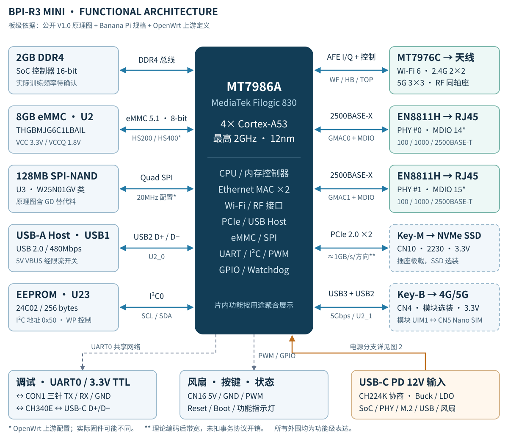
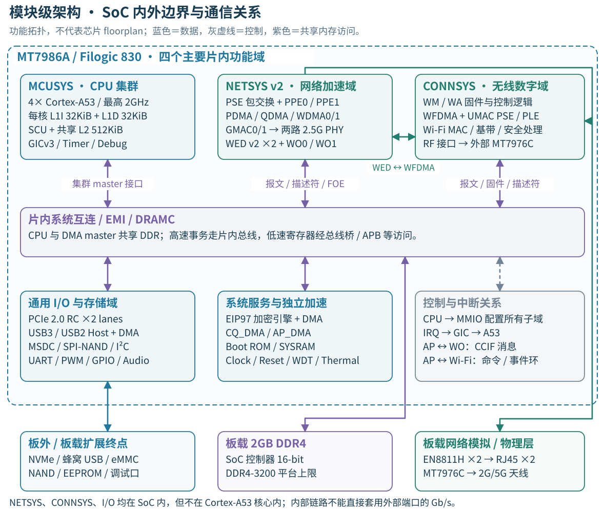
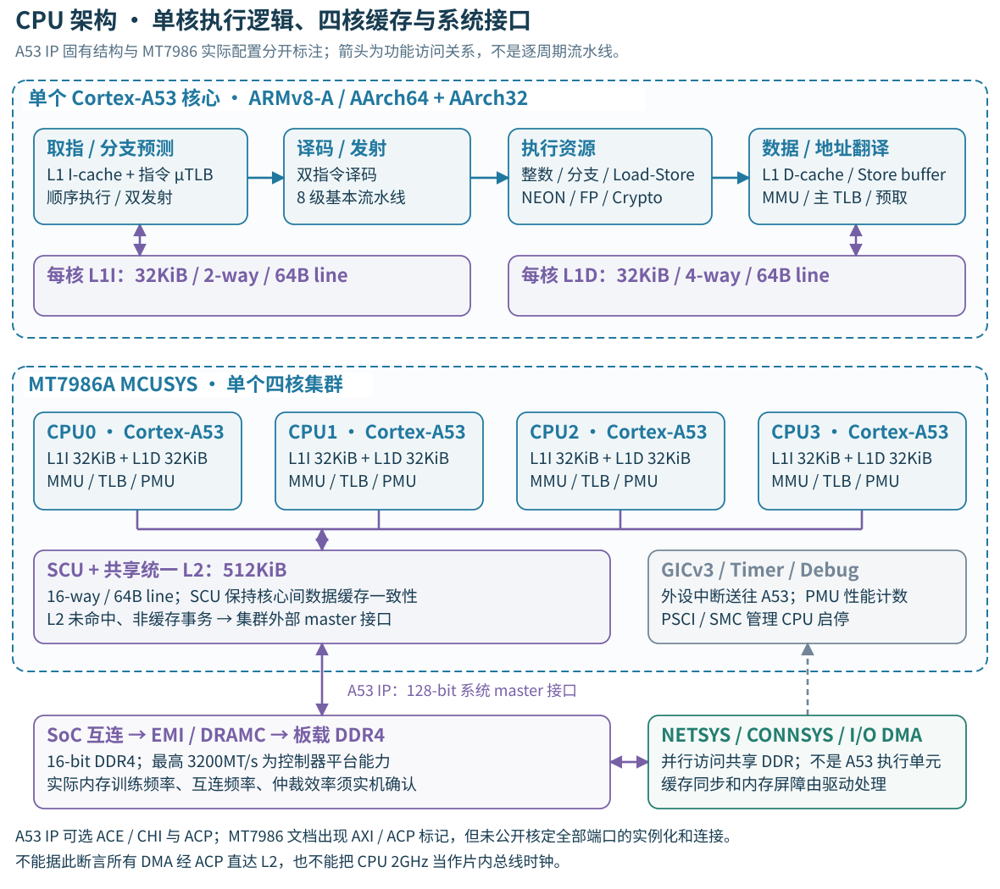
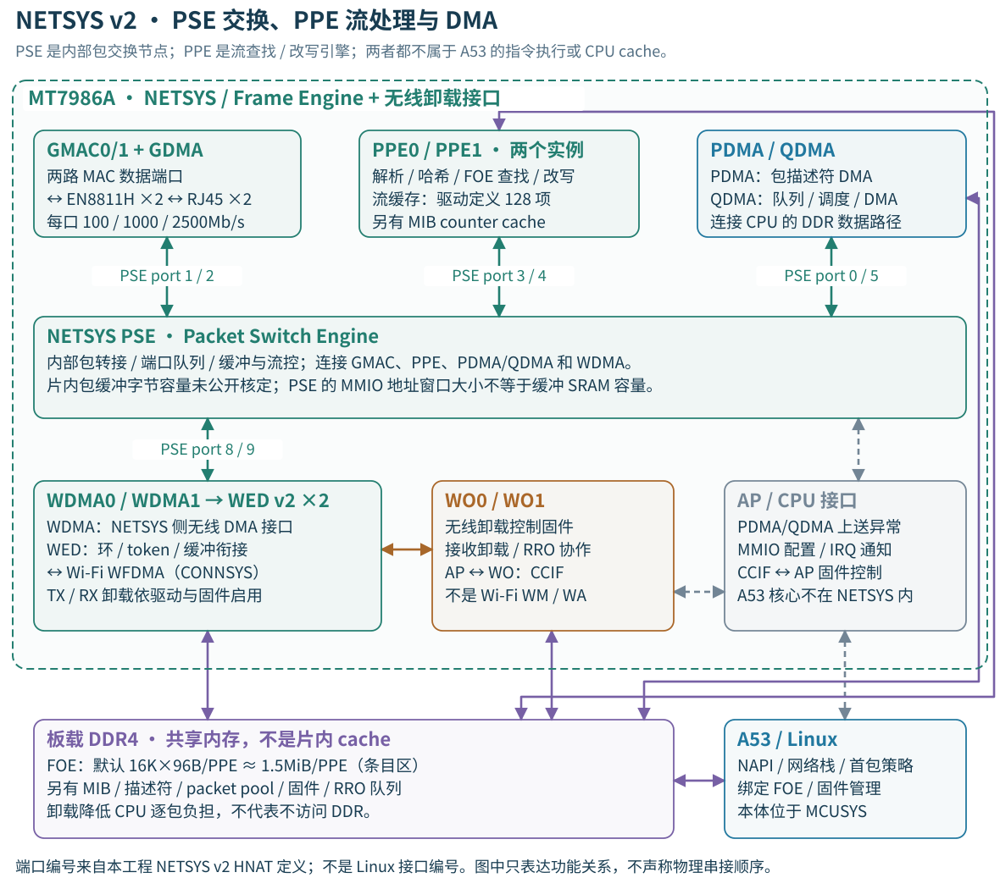
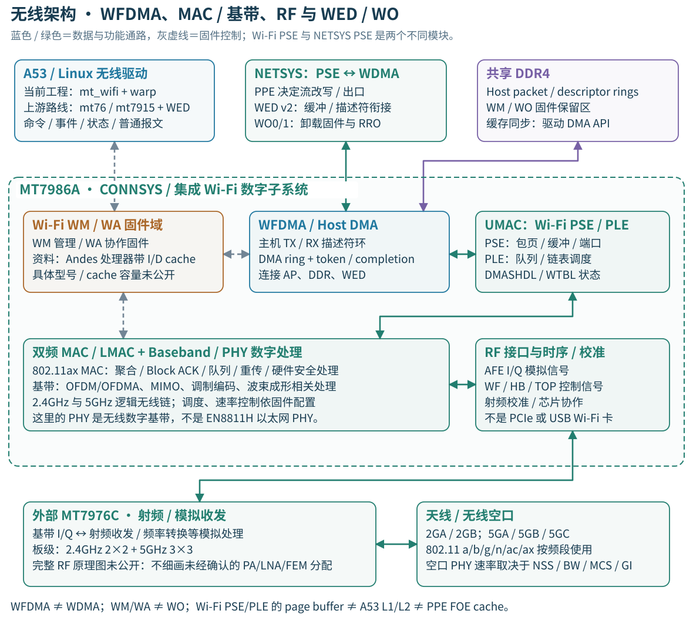
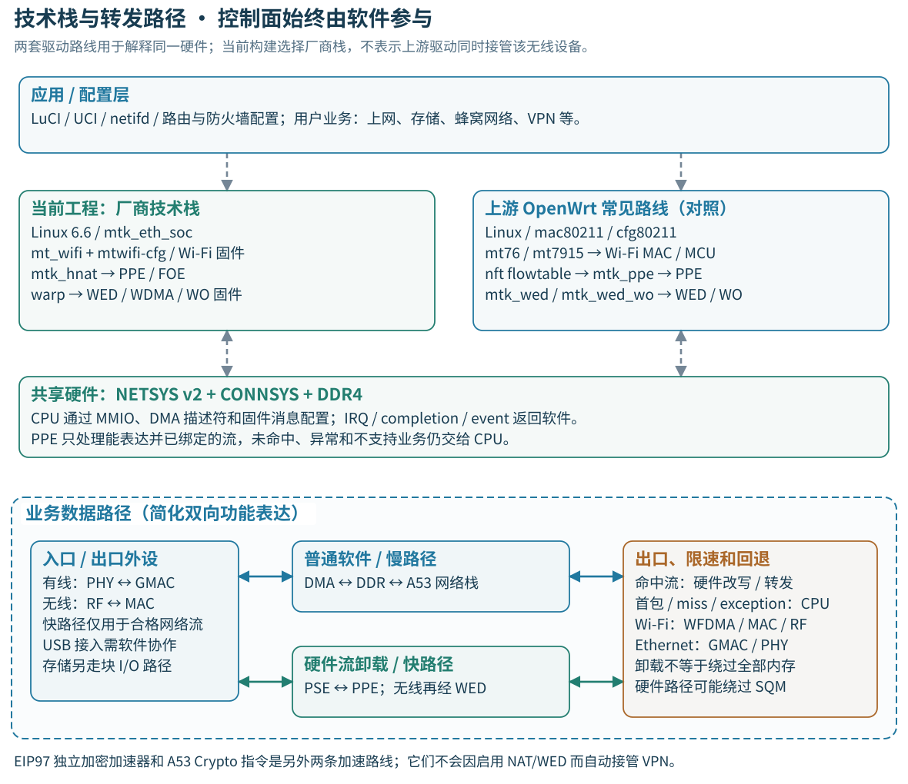
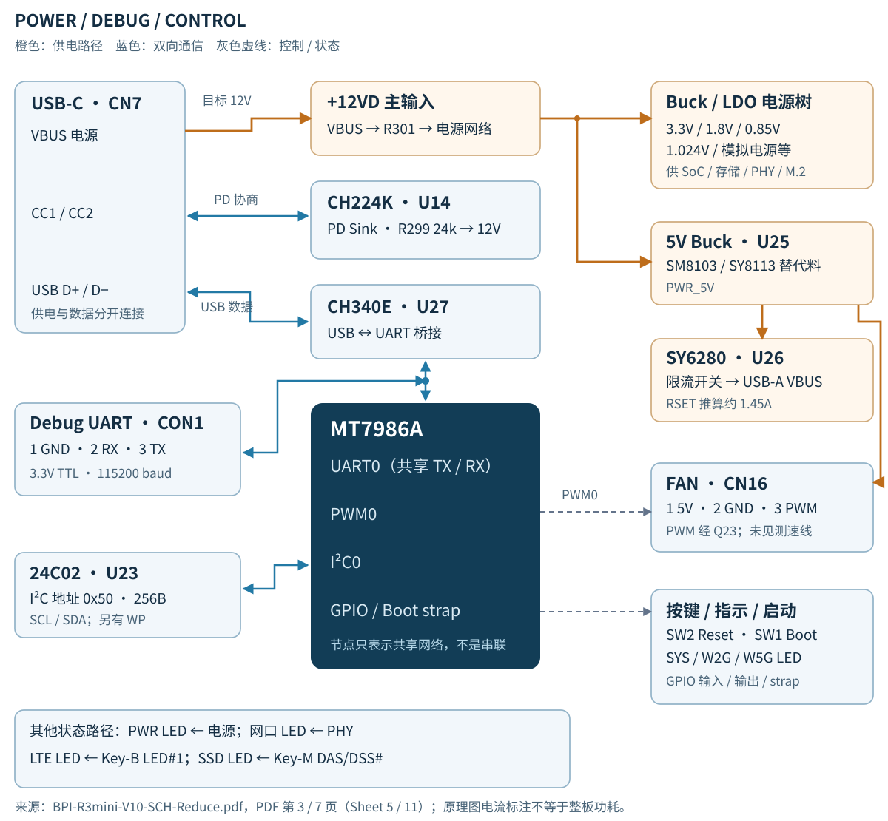
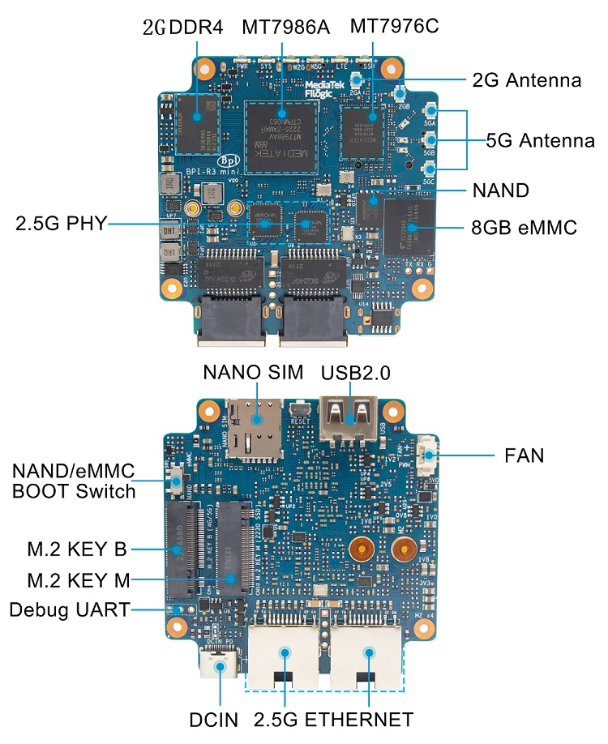

# BPI-R3 Mini 硬件架构与连接报告

<p class="subtitle">板级连接 · SoC 模块 · CPU · 硬件加速 · 无线 · 技术栈</p>
<p class="meta">更新日期：2026-09-07　｜　硬件依据：公开 V1.0 板级资料、MT7986A 手册、驱动源码　｜　版本：2.0</p>

本板以 MediaTek MT7986A 为核心，连接 DDR4、双频 Wi-Fi 射频芯片、两颗独立 2.5G PHY、eMMC、SPI-NAND、两种 M.2 扩展槽及 USB、调试和控制外设。下图按功能表达信号关系，连接线不代表 PCB 走线位置或物理针脚顺序。



<p class="caption">图 1 · 板载器件用实线边框，可选 SSD/蜂窝模块用虚线边框。蓝线为主数据链路，灰色虚线为控制/调试连接，橙线为供电。总图底部的电源与调试部分在图 2 展开。</p>

报告覆盖功能级外设和主要电源器件；未逐一列出电阻、电容、ESD、磁珠等。公开原理图为 **Reduce 精简版，共 7 个 PDF 页面**，缺少完整 DDR/RF 等页面；器件替代料、选装焊位和运行速率需与实板及固件核对。

依据：[官方硬件规格 S1](https://wiki.banana-pi.org/Banana_Pi_BPI-R3_Mini)、[官方原理图 S2](https://drive.google.com/file/d/1wvovcYf0OtvQl5fekJku25QNeER1D7cM/view?usp=sharing)、[OpenWrt 板级支持说明 S3](https://lists.infradead.org/pipermail/lede-commits/2024-February/020006.html)。

<!-- page -->

## 01　模块级总览：东西都在哪里



<p class="caption">图 M1 · 虚线大框是 SoC 边界，底部三个框是板级终点。系统互连为功能聚合：公开材料不足以恢复全部 AXI crossbar 端口、仲裁和物理布线，不将其伪装成完整片内 netlist。</p>

**CPU 负责运行软件和控制；NETSYS 负责有线包交换、流处理和无线卸载接口；CONNSYS 负责无线数字处理；通用 I/O 控制器连接存储和扩展。** 这些模块通过片内互连、共享 DDR、MMIO 寄存器、中断和固件消息协作。

PPE/PSE 在 NETSYS 内，Wi-Fi MAC/基带在 CONNSYS 内；EN8811H 和 MT7976C 是 SoC 外部芯片。EIP97 是独立密码引擎，不属于 PPE，也不等于 A53 的 Crypto 指令扩展。依据：S9 §1、S10 内存映射、L1/L2/L4。

<!-- page -->

## 02　CPU：从指令到缓存、内存和中断



<p class="caption">图 M2 · 上半部展开一个核心，下半部展示四核集群，两者不是额外叠加的 CPU。8 级是 Arm 对 A53 基本流水线的描述，并非所有指令执行延迟都是 8 周期。</p>

CPU 是 **4 核、每核单硬件线程**的 Cortex-A53 集群；最高 2GHz 是芯片能力，不保证运行时固定此频率。MMU/TLB 负责地址翻译，L1/L2 缓存数据或指令；SCU 处理核间数据一致性。GICv3 是中断控制器，不是 DMA 或缓存。依据：S9 第 7/10 页、S11 §2/5/6/7、S12、L1。

<!-- page -->

## 03　CPU / 片内总线的量化边界

| 项目 | 数值 / 架构 | 证据和解释 |
|---|---|---|
| 指令架构与执行 | ARMv8-A；AArch64 / AArch32；顺序、双发射；基本 8 级流水线 | Arm IP 结构；双发射是条件能力，不是每周期恒定完成两条指令。 |
| 每核 L1 I-cache | 32KiB，2-way，64B cache line | 容量由 MT7986A 指定；组相联与行大小由 A53 TRM 给出。 |
| 每核 L1 D-cache | 32KiB，4-way，64B cache line | 四核的私有 L1 合计 256KiB；不是一个共享 256KiB cache。 |
| 集群 L2 | 共享统一 512KiB，16-way，64B line | 四个核心共用；不是每核各有 512KiB。公开配置未列 L3。 |
| 每核地址翻译 | 指令 / 数据 µTLB 各 10 项；统一主 TLB 512 项、4-way | A53 IP 结构；另有 64 项 walk cache 和 64 项 IPA cache。TLB 项数不能当作数据缓存字节数。 |
| L1 ↔ L2 接口 | L1 指令读 / 数据读 128-bit；数据写 256-bit | A53 TRM §6.1 的局部接口宽度，不能据此推算全 SoC 的 DDR 吞吐。 |
| A53 集群对外 | IP 定义 128-bit master；可选 ACE / CHI；可选 128-bit ACP | MT7986 手册含 AXI0/AXI1/ACP/APB 标记，但未核定全部集成细节。不能直接声明采用 CCI-400，或声明所有外设缓存一致。 |
| DRAM 控制器 | 16-bit；最高 DDR4-3200；板载容量 2GB | 平台理论数据总线带宽 `3200MT/s × 16bit ÷ 8 = 6.4GB/s`；读写共享，需扣刷新、切换和仲裁。板级训练频率待运行日志确认。 |
| 中断 / 系统控制 | GICv3、Arm generic timer、PMU、PSCI/SMC；SYS_CIRQ | SYS_CIRQ 是低功耗中断汇聚/锁存辅助，不替代 GIC。时钟、WDT、GPIO、温度控制位于外围系统模块。 |

### 时钟域不等于通信速率

L1/L2、CPU、NETSYS、Wi-Fi、DDR 和 APB 不应假定同频。该工程时钟驱动有 `netsys_sel`、`netsys_500m_sel`、`netsys_2x_sel`、`netsys_mcu_sel`、`conn_mcusys_sel` 等独立选择器；例如 `netsys_500m_sel` 可选 `net1pll / 5`，`netsys_sel` 可选 `mmpll / 4`。这些是**时钟树定义**，不是本报告测得的实时频率，更不是 Gb/s。

即使知道某段总线位宽，仍需知道实际频率、每拍传输方式、读写独立性、桥接限制和仲裁效率，才能估算带宽。本报告不把 `128bit × 2GHz` 写成 MT7986 可用总线带宽。依据：S9、S10、S11、S12、L1/L8。

<!-- page -->

## 04　硬件加速：NETSYS 内部连接图



<p class="caption">图 M3 · PSE 以端口连接各处理单元。PPE 查找/改写与 PSE 交换构成功能协作，不意味着全部报文固定顺序遍历每个模块；DDR 访问也不是只能沿图中某一条线进行。</p>

PPE0/1、WDMA0/1、WED 两组及 WO0/1 的存在由 SoC 设备树和驱动交叉确认。这里的 NETSYS **v2**、WED **v2**、厂商 HNAT 驱动 **v4** 是不同版本命名体系，不能按数字大小当作同一代际。依据：S9 第 9 页；L1/L2/L4/L5。

<!-- page -->

## 05　PPE / PSE / 队列指标与真实路径

| 模块 | 位置、通信对象与职责 | 已核定指标 / 边界 |
|---|---|---|
| NETSYS PSE | Frame Engine 内的包交换节点；连 GMAC、PPE、PDMA/QDMA、WDMA | 有队列/包缓冲语义；片内缓冲字节容量未公开核定。不能把寄存器窗口当 SRAM 容量。 |
| PPE0 / PPE1 | 与 PSE 协作，解析报文、查 FOE、NAT/NAPT 或路由改写；访问 DDR 流表 | 两个实例；数据手册列 1/2/4/8/16/32K 项配置能力。32K 不是现固件必然配置。 |
| PPE flow cache | PPE 内流表缓存，配合外部 DDR FOE 主表 | 本驱动 `MAX_PPE_CACHE_NUM=128` 项；有 tag/line/data 和 cache control 寄存器。未核定真实字节容量、组相联度及内部布局。 |
| PPE MIB cache | PPE 内计数缓存；配合 DDR MIB 表 | 存在独立控制寄存器；不当作 L2，也不假定与 FOE cache 容量相同。 |
| FOE 主流表 | 驱动以 DMA API 在系统 DDR 分配，地址写入 PPE | 当前配置默认 16,384 项/PPE；v2 条目 96B，条目区约 1.5MiB/PPE，两份约 3MiB；MIB/软件记录另计，分配失败可缩表。 |
| PDMA | CPU/DDR ↔ Frame Engine 描述符搬运 | 芯片列 4 TX + 4 RX 描述符环；SG DMA；4/8/16/32 个 32-bit word 的 burst，支持延迟中断。实际驱动使用量可能较少。 |
| QDMA | 队列、调度、DDR 数据搬运，与 PSE 协作 | 芯片列 128 TX 物理队列、4 组 scheduler，最多 1024 虚拟队列/8 组 SFQ；SP/WFQ、队列 min/max rate。当前以太网驱动的 16 队列常量不是芯片上限。 |
| WDMA / WED / WO | NETSYS ↔ CONNSYS 的无线卸载协作路径 | WDMA 是网络侧 DMA；WED 处理环、token、缓冲衔接；WO 运行卸载固件。方向和功能依驱动启用，不是插上就保证所有包卸载。 |

### 三类功能路径

**有线 ↔ 有线命中流：** PHY ↔ GMAC/GDMA ↔ PSE/PPE ↔ GMAC/GDMA ↔ PHY。**有线 ↔ 无线命中流：** 在 NETSYS PSE/PPE 与无线 MAC 之间增加 WDMA、WED、WFDMA；接收卸载可涉及 WO/RRO。**首包、未绑定流与异常：** DMA ↔ DDR ↔ IRQ/NAPI ↔ A53 网络栈，再决定是否建立硬件流。

流表项通常描述方向相关的硬件流，不等于同数量完整双向 TCP 会话；也不能把两个 PPE 的容量简单相加作为统一会话保证。手册限定“128 flows 内任意包长 wire-speed”的条件性描述，未给足以保证任意 32K 流、多功能叠加下的统一 Mpps 指标。来源：S9 §1.3、L1/L2/L5。

<!-- page -->

## 06　无线子系统：数字、固件与射频分层



<p class="caption">图 M4 · 无线逻辑分层图，不是完整基带硬件流水线。WED ↔ WFDMA 是集成式卸载关系；本板无线不占用 Key-M 的 PCIe ×2 链路。</p>

MT7986A 集成无线数字子系统，外接 MT7976C 完成射频侧连接；主板的 NVMe 则走独立 PCIe Root Complex。无线 WM/WA 固件与 NETSYS 的 WO 固件分别承担管理和卸载相关职责，不应合并成一个“Wi-Fi CPU”。依据：S2、S9 §1.2、L1/L3/L4、S15。

<!-- page -->

## 07　无线模块、缓存和速率

| 模块 / 参数 | 功能 / 可确认值 | 需要注意的边界 |
|---|---|---|
| WM / WA | MT7986 驱动加载 WM ROM patch、WM firmware、WA firmware；数据手册列 Andes 处理器带 I/D cache | 手册未给 Wi-Fi MCU 的精确核型号、频率和 cache 容量；不能套用其他芯片的 N9/CR4 参数。 |
| WFDMA / Host DMA | 通过 TX/RX 环、token、完成事件搬运/交接无线主机报文；与 WED、DDR、驱动配合 | 与 NETSYS WDMA 不是同一个控制器；驱动环布局不等于硅片最大环数。 |
| Wi-Fi PSE | 无线 UMAC 的包页缓冲/端口模块 | 驱动解码页大小为 128B 或 256B，总页数来自寄存器；总字节数须读取配置后计算。不是 NETSYS PSE。 |
| Wi-Fi PLE | Packet Link Engine，队列/包链、空闲页及站点 AC 队列管理 | 驱动解码页大小为 64B 或 128B，总页数来自寄存器。页容量不等于可用净载荷容量。 |
| WTBL / DMASHDL | WLAN station/table 状态；DMA 调度相关逻辑 | 这些表和队列不是 CPU cache；本报告不从其它型号外推总容量。 |
| MAC 硬件功能 | A-MPDU/A-MSDU 聚合/解聚合、Block ACK、重传、速率控制配合、AES-CCMP/GCMP | Wi-Fi 链路加密不同于对 WAN VPN 隧道进行加密；功能启用依驱动、固件、协商。 |
| 基带 / PHY | 芯片支持 802.11ax、MCS0–11、20/40/80/160MHz 等平台能力，OFDMA / MU-MIMO / LDPC | R3 Mini 板级为 2.4GHz 2×2 + 5GHz 3×3；不能把平台 4×4+4×4 / 6GHz 宣传直接套到板卡。 |
| RF / 天线 | MT7976C；2GA/2GB 与 5GA/5GB/5GC 共五个频段天线位置 | AFE I/Q 是模拟连接，专用数字控制没有公开可核定的统一 Gb/s；完整 PA/LNA/FEM 分配不在精简图内。 |

### 条件性 PHY 速率示例，不是整机保证

以 802.11ax、MCS11、GI=0.8µs、足够信噪比为前提：2 空间流/40MHz 约 **573.5Mb/s**；3 空间流/80MHz 约 **1801.5Mb/s**；3 空间流/160MHz 约 **3602.9Mb/s**。后两项是标准单流速率按 3 NSS 换算，**不是已证明本板所有固件均开放 3×3@160MHz**。2×2 客户端也无法使用 AP 的第三空间流。

无线空口共享时间，MAC 开销、竞争、重传和 TCP/UDP 降低净吞吐；不能把双频 PHY 相加作为单客户端速率。板级实际 BW/NSS、国家码、DFS/TPC、校准与功率须读取实机状态。依据：S1/S2/S9、L3；标准速率参照 [Cisco Wi-Fi 6 测试说明 S16](https://www.cisco.com/c/en/us/support/docs/wireless-mobility/wireless-lan-wlan/212892-802-11ac-wireless-throughput-testing-and.html)。

<!-- page -->

## 08　内存清单：哪些是 cache，哪些不是

| 对象及所属模块 | 类型 / 数值 | 存在位置、用途与证据 |
|---|---|---|
| A53 L1I / L1D | 真正 CPU cache；每核各 32KiB | 核心私有片内缓存；四核合计 256KiB。S9/S11。 |
| A53 L2 | 真正 CPU cache；共享 512KiB | MCUSYS 四核共享，不分给每个外设专用。S9/S11。 |
| A53 TLB / walk cache | 地址翻译缓存；见 CPU 参数页 | 记录映射/页表信息，不是报文缓存。S11。 |
| PPE flow cache | 流表缓存；驱动定义 128 项 | 在 PPE；真实字节容量未核定，不能乘 96B 就断言 SRAM 大小。L2。 |
| PPE MIB cache | 硬件计数缓存；容量未核定 | 独立于 FOE cache；对应外部 MIB 表。L2。 |
| DDR FOE 条目区 | 主流表；默认 16K×96B/PPE≈1.5MiB | DMA 分配的系统内存，不是 PPE 片内缓存；配置/缩表会变化。L2/L5。 |
| NETSYS PSE buffer | 包队列/缓冲；字节容量未核定 | 不得用 NETSYS-1 的 128KiB 地址窗口冒充容量。S10/L2。 |
| Wi-Fi PSE / PLE buffer | 硬件分页包缓冲；大小由页数×页粒度计算 | PSE 128/256B；PLE 64/128B。需寄存器实值，且总页数不等于空闲页数。L3。 |
| Wi-Fi MCU I/D cache | 手册确认存在；容量未给 | 与四核 A53 cache、WO 内存都不同。S9。 |
| WO0/WO1 ILM | 本地指令内存窗口；每个 32KiB | DTS 地址 0x151e0000 / 0x151f0000；是本地内存映射，不称作 I-cache。L1。 |
| WO0/WO1 DLM | 本地数据内存窗口；每个 8KiB | DTS 地址 0x151e8000 / 0x151f8000；可用于卸载协作数据，不称作 D-cache。L1/L4。 |
| WM 固件 DDR 保留区 | 1MiB，0x4fc00000 | `wmcpu_emi`；这是设备树保留区，不代表 MCU 内部 SRAM/cache。L1。 |
| WO 固件 DDR 保留区 | 每个 256KiB；0x4fd00000 / 0x4fd40000 | `wocpu0_emi` / `wocpu1_emi`。L1。 |
| WO 共享 DDR data | 2.25MiB；0x4fd80000 | `wocpu_data` 长度 0x240000。L1。 |
| DMA rings / packet pool / RRO | 按驱动动态分配或保留 | WARP 常量示例：MIOD 16 项、entry 128B，feedback 1024 项，RRO queue 8192 项；不能把所有队列项都按同一尺寸相乘。L4。 |

**单位约定：** KiB/MiB 按 1024；通信 GB/s 按 10⁹。数据手册缓存“KB”在本报告按常用二进制缓存容量表达；商业“8GB eMMC”“2GB 内存”保留板卡标称。寄存器地址范围、保留内存、可用页数和物理 SRAM 容量是四种不同概念。

<!-- page -->

## 09　DMA 与片内控制器清单

| DMA / 控制器 | 属于哪个模块、连接谁 | 数据传输 / CPU 角色 |
|---|---|---|
| PDMA | NETSYS Frame Engine ↔ 系统 DDR | 报文/描述符 DMA，接 CPU 常规收发路径；CPU 建环、处理 IRQ/NAPI。 |
| QDMA | NETSYS 队列/调度 ↔ DDR/PSE | TX 队列与速率调度、数据搬运；不是 CPU 执行软件 qdisc。 |
| WDMA0/1 | NETSYS ↔ WED/无线卸载路径 | 转接无线相关 packet/descriptor；不要和 WFDMA 合并。 |
| WFDMA | CONNSYS 无线 Host DMA | 对接主机 rings、packet buffer、Wi-Fi 逻辑与 WED；CPU/固件发命令及回收状态。 |
| WED / WO 协作 | NETSYS 无线卸载模块 | WED 含描述符/缓冲处理逻辑，WO 配合接收/RRO；并非一颗取代所有 DMA 的“超级 CPU”。 |
| USB xHCI DMA | SSUSB Host ↔ DDR ↔ USB 总线 | 主机控制器按 TRB/transfer ring 发起传输；蜂窝业务仍需要 USB 网络驱动。USB3/2 外部速率见板级表。 |
| PCIe endpoint bus master | SSD NVMe 控制器 ↔ PCIe RC ↔ DDR | NVMe 的 DMA master 在 SSD 控制器；RC 提供总线事务桥接，不能把 PCIe lane 本身叫 DMA 控制器。 |
| MSDC DMA | eMMC/SD 控制器 ↔ DDR | 手册给 Basic / Descriptor DMA、总线 master；板上接 8-bit eMMC。NAND/eMMC 也不经过 PPE。 |
| SPI DMA / NFI / ECC | 串行 / 闪存接口域 ↔ 内存 | 手册有 SPI FIFO/DMA、NFI/ECC 模块；本板 SPI-NAND 的具体控制器与 DMA 模式看驱动，不凭 SoC 存在 NFI 就假定直连并行 NAND。 |
| CQ_DMA / AP_DMA | 系统外围；手册内存映射可见 | 基址 0x10212000 / 0x10217000；每个 4KiB 是寄存器窗口，不是通道缓冲。通道数/吞吐未核定。 |
| EIP97 + DMA | 独立密码引擎 ↔ DDR；Linux Crypto API | 手册映射基址 0x10320000；可由 safexcel 驱动使用。算法/模式/吞吐必须由实际调用链和实测确认。 |
| I²C / UART / PWM / GPIO | 低速控制外设，经片内总线桥访问 | 不能假定每个外设都启用 DMA；I²C 手册给 16B FIFO、最高 400kHz，串口此板常用 115200。 |

### DMA、缓存一致性和内存屏障

CPU 通常先在内存准备描述符，再通过 MMIO doorbell/索引通知控制器；设备搬运后更新完成状态并触发中断。`dma_alloc_coherent()` 提供 CPU/设备可一致访问的分配语义，**不证明所有设备均经 ACP 硬件 snoop CPU L2**。流式 DMA 使用 map/unmap 或 sync；驱动还需正确使用内存屏障，保证描述符和所有权更新顺序。

CPU 硬件一致性、DMA API 的一致性保证、DMA 数据复制、零拷贝是不同概念。框图只画逻辑共享内存，不暗示“设备只能访问不缓存 DDR”或“设备一定能访问全部 CPU cache”。依据：S10、L1–L5、[Linux DMA 指南 S13](https://docs.kernel.org/core-api/dma-api-howto.html)。

<!-- page -->

## 10　技术栈与软硬件数据路径



<p class="caption">图 M5 · 上半部是配置/驱动控制面，下半部是简化业务路径。软件 flowtable 仍在 A53 执行；PPE hardware offload 才把相应报文处理交给硬件，两者不是同一个开关含义。</p>

启动链也分层：**Boot strap 选择介质 → Boot ROM → BL2/TF-A 与 DDR 初始化 → U-Boot → Linux → 用户态网络服务**。无线与 WO 固件由相关驱动加载/启动；不要把它们画在 Linux 普通应用层。具体镜像布局和版本依所刷固件，不能从 SoC 型号推定。依据：S7、S10、L1/L3/L4/L6；软件 flowtable 语义见 S14。

<!-- page -->

## 11　该工程实际选了什么，什么仍未证明

| 层级 | 本地构建证据（2026-09-07） | 意义 |
|---|---|---|
| 板卡目标 | `CONFIG_TARGET_mediatek_filogic_DEVICE_bananapi_bpi-r3-mini=y` | 目标是本板，不是 BPI-R3 / R4。 |
| Linux 平台 | 已生成内核目录为 Linux 6.6.133；NETSYS_V2=y，NETSYS_V3 未选 | 用本工程已展开补丁的源码核定实际定义；不能拿 MT7988/NETSYS v3 参数替代。 |
| 无线厂商栈 | `kmod-mt_wifi=y`、`kmod-warp=y`；`mtwifi-cfg`、`wifi-dats` 已选 | 当前技术路线是 mt_wifi + WARP，而不是默认套用 mac80211。 |
| mac80211 | `CONFIG_PACKAGE_kmod-mac80211` 未选 | 上游 mt76/mt7915 路线在报告中作为对照，不冒充当前工作路径。 |
| 硬件 NAT | `kmod-mediatek_hnat=y`；内核 `NET_MEDIATEK_HNAT=m` | 厂商 HNAT 管理 PPE；是否加载、绑定了哪些流要看实机。 |
| WED 支持 | 内核 `NET_MEDIATEK_SOC_WED=y` | 代表构建含支持；不等于所有无线收发均已卸载。 |
| Crypto | `kmod-crypto-hw-safexcel=y`；内核 safexcel=m | 只证明选了驱动，不能证明用户 VPN 已走 EIP97。 |
| FOE 默认分支 | 未见 `CONFIG_MEDIATEK_NETSYS_RX_V2`；代码 fallback=16K | 与 NETSYS_V2 不是同一个配置项；内存分配失败还可缩表。 |

### 哪些业务可能不走同一条“快路径”

**NAT/路由：** 首包仍要软件决定策略；合格流绑定后可交 PPE。nft flowtable、厂商 HNAT 的建流机制与可用字段不完全相同，不能混用开关或统计方法。

**SQM / CAKE / fq_codel：** 软件排队在 CPU 路径；硬件流卸载可能绕过期望的软件 qdisc。QDMA 的 SP/WFQ/min-max shaping 不等价于 CAKE，启用硬件 QoS 也不证明 SQM 仍完整生效。

**VPN / TLS：** A53 Crypto 指令、EIP97 内核加密和 Wi-Fi 链路安全是三个不同层级；PPE 不自动完成任意 VPN 加密。实际速度取决于协议、算法、驱动和上层调用。

**蜂窝 / USB 网卡 / 存储：** HNAT 的 `usb/wwan/rmnet` 扩展接口前缀是软件接入线索，不是 PSE 内新增 USB 硬件端口。NVMe/eMMC 文件访问通常走块设备与文件系统栈，不走 NAT 流表。

以上只是本地源码和**构建选择**，没有远程连接实机，不能证明这些产物已刷入或功能已开启。依据：L1/L2/L5/L6，S13/S14。

<!-- page -->

## 12　还缺哪些实机指标，如何只读核对

| 待核定项 | 为什么本报告未填固定值 | 建议证据 |
|---|---|---|
| CPU、L2、NETSYS、Wi-Fi、DDR 的实时频率 | 多时钟域、动态调频、bootloader 初始化和运行状态会改变值 | CPUFreq sysfs、已启用的 `clk_summary`、Boot/DDR 训练日志；留存当前固件版本。 |
| NETSYS PSE 字节缓冲容量 | 手册公开版不含足够细节；地址窗口不能代替 SRAM 参数 | MT7986 专属完整硬件资料；不要拿 MT7988 128/256KiB 数值外推。 |
| Wi-Fi PSE/PLE 当前总/空闲页 | 驱动提供寄存器解码，但本报告无实机读数 | 对应驱动已支持的 PSE/PLE 诊断输出，记录页粒度和页数；不盲目用 devmem。 |
| 无线 MCU cache 大小、内部频率 | 公开数据手册只确认有 Andes I/D cache | 对应芯片厂商完整规格；WM/WA/WO 分别核定，不混用。 |
| WED TX/RX、WO/RRO 是否启用 | 包含模块不等于环已挂接、固件运行、流已命中 | 启动日志、已加载模块、驱动统计、绑定/异常计数；debug 命令因厂商/上游栈不同。 |
| 无线 3×3@160、功率、DFS 等 | 板级能力、驱动、校准、国家码和客户端都会约束 | 当前驱动 capability 与实际 station/radio 状态；cfg80211 路线可用 `iw`。 |
| 路由/桥接/VPN/SQM 吞吐、PPS、时延 | 端口带宽不是业务实测；多加速功能可能互相约束 | 分开测试软件与硬件路径，记录包长、连接数、方向、CPU占用、温度和丢包。 |

以下只读命令应在**目标路由器**运行，不是在编译主机运行；文件缺失表示当前内核/驱动未提供该接口，不能直接解释为无硬件能力。

```sh
uname -a
ubus call system board
lsmod
dmesg | grep -Ei 'mt7986|PPE|hnat|WED|warp|WOCPU|DDR|DRAM'
for c in /sys/devices/system/cpu/cpu0/cache/index*; do
  echo "$c"
  for f in level type size coherency_line_size ways_of_associativity shared_cpu_list; do
    test ! -r "$c/$f" || { printf '%s: ' "$f"; cat "$c/$f"; }
  done
done
test ! -r /sys/kernel/debug/clk/clk_summary || cat /sys/kernel/debug/clk/clk_summary
ethtool eth0
ethtool eth1
# 仅当当前无线驱动提供 cfg80211 / nl80211 时：
iw phy
```

不在本报告内自动启用 offload、修改防火墙、挂载 debugfs、改寄存器或发起压测。涉及 NAT 表、无线站点统计时还应注意其中可能包含真实网络地址。完成运行核对后，才可把“能力/配置”列升级为“实测”。

<!-- page -->

## 13　主器件与高速外设

表中的“板级”来自板卡规格或原理图；“软件配置”指核对时的 OpenWrt 上游设备树；“理论”是总线编码换算，均不代表实测吞吐量。

| 器件 / 外设 | SoC 到外设的连接 | 关键指标与用途 |
|---|---|---|
| MT7986A / Filogic 830 | 系统中心；集成处理器、网络和外设控制器 | 4× Cortex-A53，平台最高 2GHz，12nm；带网络加速能力。路由、VPN、SQM 性能还取决于软件路径。 |
| 2GB DDR4 | 16-bit DDR4 控制器数据接口 | 板级容量 2GB；SoC 支持最高 DDR4-3200（理论 6.4GB/s）。精简图缺完整内存页；实板训练频率、颗粒料号与实测带宽未核定。 |
| MT7976C 无线射频芯片 | MediaTek 专用 RF/控制连接：AFE I/Q、WF/HB、TOP 等 | 板级 Wi-Fi 6，2.4GHz 2×2、5GHz 3×3；射频输出接板上天线座。专用链路无公开可直接套用的 PCIe/USB 带宽数值。 |
| EN8811H ×2 | 两路 GMAC 的 2500BASE-X；另有 MDC/MDIO、Reset、IRQ | 每颗一口 100/1000/2500BASE-T，分别通向两个 RJ45；PHY 支持 HSGMII/2500BASE-X，DTS 采用 `2500base-x`。 |
| 8GB eMMC，U2 | 8-bit eMMC；DAT0–7、CMD、CLK、DS、RST | 原理图料号 THGBMJG6C1LBAIL，eMMC 5.1；VCC 3.3V、VCCQ 1.8V。软件配置最高 200MHz，并声明 HS200/HS400 能力。 |
| 128MB SPI-NAND，U3 | Quad SPI；原理图信号名 `SPI2_*` | 原理图标注 W25N01GVZEIG，并列 GD5F1GQ5UEYIGR 替代料；1Gbit＝128MiB。上游 `&spi0` 节点设置 20MHz、TX/RX 宽度 4。原理图信号名与 Linux 控制器编号不能直接互换。 |
| M.2 Key-M，CN10 | PCIe 2.0 ×2；REFCLK、PERST#、CLKREQ#、PEWAKE# | 2230 SSD 安装位，3.3V 卡电源；使用 NVMe。5GT/s/通道，×2 在扣除 8b/10b 编码后约 1GB/s/方向，尚未扣除协议开销。 |
| M.2 Key-B，CN4 | USB 3.0 SuperSpeed + USB 2.0 D+/D−；附电源/复位控制 | 3052 类模块位置，3.3V 卡电源；USB 3.0 为 5Gbps，另有 USB2 兼容链路。用于 USB 型 4G/5G 模块。 |
| USB-A，USB1 | SoC `U2_0_USB_DP/DM` | USB 2.0 Host，480Mbps；5V VBUS 经独立限流开关输出。 |
| Nano SIM，CN5 | 蜂窝模块 UIM1 经 Key-B 接到卡座 | VDD、CLK、RST、DATA、DET；SIM 由模块访问，VDD 来自模块 UIM1-PWR。无模块时 SIM 卡座不能作为独立 SoC SIM 读卡器。 |

SoC 平台能力依据 [MediaTek S5](https://www.mediatek.com/products/broadband-wifi/mediatek-filogic-830)；板级器件、接口依据 [S2 原理图](https://drive.google.com/file/d/1wvovcYf0OtvQl5fekJku25QNeER1D7cM/view?usp=sharing) 和 [S3 上游支持说明](https://lists.infradead.org/pipermail/lede-commits/2024-February/020006.html)；软件数值依据 [S4 上游 DTS](https://github.com/openwrt/openwrt/blob/main/target/linux/mediatek/dts/mt7986a-bananapi-bpi-r3-mini.dts)。

<!-- page -->

## 14　网络路径与速率含义

两个有线端口各有一条独立的 MAC → PHY → RJ45 路径。上游将 GMAC0 关联到 MDIO 地址 14 的 PHY，将 GMAC1 关联到地址 15 的 PHY；LAN/WAN 是固件分配的角色。这条板级路径无需插入额外 MT7531 交换芯片。来源：[S3](https://lists.infradead.org/pipermail/lede-commits/2024-February/020006.html)、[S4](https://github.com/openwrt/openwrt/blob/main/target/linux/mediatek/dts/mt7986a-bananapi-bpi-r3-mini.dts)。

| 信号层 | 连接端点 | 功能 / 指标 |
|---|---|---|
| MAC ↔ PHY 数据 | MT7986A ↔ EN8811H | 2500BASE-X 串行链路；TX/RX 差分对。 |
| PHY 管理 | SoC MDC/MDIO ↔ 两颗 PHY | 管理寄存器、链路状态、参数配置；不承载网口业务报文。 |
| PHY 控制 | SoC GPIO ↔ PHY | Reset / Interrupt；上游 PHY14 为 reset GPIO49、IRQ48，PHY15 为 reset GPIO47、IRQ46。 |
| 铜缆 Ethernet | PHY ↔ 磁性隔离 / RJ45 ↔ 网线 | 100/1000/2500BASE-T；IEEE 802.3u / 802.3ab / 802.3bz；千兆与 2.5G 使用四对线。 |
| PHY 功能 | EN8811H | 自动协商、全双工流控、EEE、自动交叉/极性校正，芯片支持最高 9KB Jumbo Frame；能否启用还取决于整个数据路径。 |

PHY 能力依据 [Airoha EN8811H 官方说明 S6](https://www.airoha.com/products/p/tKkm7DPXi5m6wY2D)。两口均为 2.5G 不等于所有路由场景都能线速：NAT offload、软件转发、加密、SQM 和包长会改变 CPU 负担。本报告未执行性能实测。

### Wi-Fi 芯片间连接和天线

MT7986A 与 MT7976C 的连接包含模拟 AFE I/Q 和专用数字控制/时序网络。精简原理图中的 `AFE0/AFE1_WF*_I/Q`、`WF*_HB*`、`WF*_TOP_CLK/DATA` 等信号共同构成 RF 连接。不能把整组连线简化成一条普通数字扩展总线，也不在图中对其标注未经确认的固定 Gb/s 指标。

板级规格是 **2.4GHz 2×2 + 5GHz 3×3**。官方照片显示 2GA、2GB 和 5GA、5GB、5GC 天线位置。具体信道宽度、空间流组合、监管区域、发射功率及最终 PHY 速率应由实机 `iw phy` 和驱动状态确认；公开精简原理图不能单独证明全部组合。来源：[S1](https://wiki.banana-pi.org/Banana_Pi_BPI-R3_Mini)、[S2](https://drive.google.com/file/d/1wvovcYf0OtvQl5fekJku25QNeER1D7cM/view?usp=sharing)、[S8 官方照片](https://www.banana-pi.org/web/userfiles/product/BPI-R3%20MINI%20interface.jpg)。

### 总线速率如何换算

| 链路 | 标称值 | 解读 |
|---|---|---|
| 单口 2.5G Ethernet | 2.5Gbps | 约 312.5MB/s 的比特/字节换算；TCP/UDP 应用速率还需扣除开销。 |
| PCIe 2.0 ×2 | 5GT/s ×2 | `5×2×8/10÷8 ≈ 1GB/s`，每方向独立；NVMe SSD 实际速度更低。 |
| USB 3.0 | 5Gbps | 8b/10b 编码后约 500MB/s，未扣 USB 协议开销；不是蜂窝空口速率。 |
| USB 2.0 | 480Mbps | 原始换算 60MB/s，应用传输达不到这个值。 |
| eMMC HS400 | 200MHz、8-bit、DDR | 理论总线约 400MB/s；存储芯片的读写性能不等于接口上限。 |
| Quad SPI @20MHz | 4-bit 数据阶段 | 理想数据阶段约 10MB/s；NAND 命令、读页、编程和 ECC 另有时间。 |

以上换算用于比较链路上限。Wi-Fi 两频段标称值不能直接当成单客户端速率，两个有线口的速率也不能相加作为 WAN 下载速度。

<!-- page -->

## 15　供电、调试与控制连接图



<p class="caption">图 2 · 同一个 USB-C 的 VBUS、CC 和 D+/D− 分别进入电源、PD 协商和 USB-UART 路径。CH224K 控制协商，主电流沿 VBUS 电源网络进入稳压器。UART 三针排针与 CH340E 共用 SoC UART0。</p>

原理图 CN7 使用 USB2 Type-C 连接器：VBUS 经 R301 到 `+12VD`，CC1/CC2 接 CH224K，D+/D− 经 R362/R363 接 CH340E。CH340E 的 UART 侧经 R365/R366 接 UART0；CON1 直接连接同一对 UART0 网络。来源：[S2，PDF 第 7 页 / Sheet 11](https://drive.google.com/file/d/1wvovcYf0OtvQl5fekJku25QNeER1D7cM/view?usp=sharing)。

USB-C 的数据连接不自动意味着电脑 USB 口能够提供所需 12V PD。实际接线须同时满足供电和串口主机条件，不能由图示推定普通电脑端口即可供整板正常运行。

<!-- page -->

## 16　电源轨和低速外设参数

| 电源 / 器件 | 原理图标注 | 用途与边界 |
|---|---|---|
| USB-C PD；CH224K，U14 | 目标 12V；CFG 电阻 R299＝24kΩ | 官方规格标 20W/12V；教程给出 PD 12V/1.5A 或以上。12×1.5＝18W，因此 20W 是文档的供电等级标称。 |
| MP8759GD，UP3 | `3.3VD`，3.3V / 8A | 板级 3.3V 电源及后续分支，包含存储和扩展供电路径。 |
| MP8756GD，UP5 | `DVDD_CORE`，0.85V / 6A | SoC Core 电源。 |
| MP8756GD，UP7 | `DVDD_PROC_L`，1.024V / 6A | 原理图标注 CA53 Core。 |
| MP8756GD，UP1 | `1.8VD`，1.8V / 6A | 1.8V 电源及部分 LDO 输入；eMMC VCCQ 在此电压域。 |
| SGM2032，UP2 / UP6 / UP8 | 0.9V / 1.8V / 2.5V，各 300mA | 分别对应 `0.9VD`、`AVDD18`、`DDRV_VPP` 等网络。 |
| WL2803E12-5，UP4 | `AVDD12`，1.2V / 500mA | 模拟电源分支；不能据此推定它独自供整颗 DDR4。 |
| SM8103ADC，U25 | 5V Buck；3A / 500kHz | 原理图另列 SY8113BADC 替代料；输出 `PWR_5V`，接风扇及 USB 限流器。 |
| SY6280AAC，U26 | USB VBUS 限流；R361＝4.7kΩ | 按图中 `6.8k/Rset` 公式估算约 1.45A；这是限流估算，非保证持续输出。 |

上述电流是**原理图设计标注或器件级能力**，不代表所有电源轨能够同时满载，更不是整板实际功耗。M.2 槽的连续/峰值供电预算未在公开板卡规格中单独保证，应结合模块数据手册和整板输入预算核算。来源：[S2](https://drive.google.com/file/d/1wvovcYf0OtvQl5fekJku25QNeER1D7cM/view?usp=sharing)、[S7 供电教程](https://wiki.banana-pi.org/Getting_Started_with_BPI-R3_MINI)。

| 外设 | 连接 / 指标 | 说明 |
|---|---|---|
| UART0；CON1、CH340E U27 | 3.3V TTL；官方 115200 baud | 原理图针号：1＝GND，2＝RX，3＝TX，RX/TX 以主板为参照。USB 串口桥和三针口共享 UART，不是两个独立 UART。 |
| EEPROM；U23 | P24C02A / AT24C02；I²C0 地址 0x50；256B | SCL/SDA；有写保护网络。可存板卡数据；当前 DTS 声明 EEPROM，但仅凭该节点不能证明固件已从中读取 MAC。总线频率未作板级保证。 |
| 风扇；CN16 | 1.25mm 间距，3 功能针：5V/GND/PWM | PWM0 经 Q23；原理图未显示独立测速线。教程示例周期 10000ns＝100kHz，属于软件示例值。 |
| Reset；SW2 | 上游 GPIO7，低有效 | 原理图网名为 `GPIO_2`，SoC 符号映射到 Linux GPIO7；网名不等于 Linux GPIO 编号。 |
| Boot；SW1 | 启动 strap：NAND / eMMC | 开关在上电启动阶段选择介质；官方说明无 SD 卡启动。 |
| LED | PWR、SYS、W2G、W5G、LTE、SSD | PWR 来自电源；SYS/Wi-Fi 来自 SoC 控制；LTE 来自 Key-B LED#1，SSD 来自 Key-M DAS/DSS#；网口另有 PHY LED。 |

原理图针号不等于从任意观察方向看到的左右顺序。GPIO/PWM/EEPROM 参数依据 [S2](https://drive.google.com/file/d/1wvovcYf0OtvQl5fekJku25QNeER1D7cM/view?usp=sharing)、[S4](https://github.com/openwrt/openwrt/blob/main/target/linux/mediatek/dts/mt7986a-bananapi-bpi-r3-mini.dts) 和 [S7](https://wiki.banana-pi.org/Getting_Started_with_BPI-R3_MINI)。

<!-- page -->

## 17　扩展接口、完整性与待确认项

### 两种 M.2 的连接边界

Key-M 的 Lane0/1、参考时钟及复位/唤醒信号构成 PCIe NVMe 路径。插座符号中出现 SATA 名称是通用引脚定义，不能据此判定本板支持 SATA SSD。Key-B 的主数据线实际连接 USB SuperSpeed 和 USB2，适用 USB 型蜂窝模块；LTE/5G 空口由所装模块实现，蜂窝天线也连接模块自身。来源：[S2](https://drive.google.com/file/d/1wvovcYf0OtvQl5fekJku25QNeER1D7cM/view?usp=sharing)、[S3](https://lists.infradead.org/pipermail/lede-commits/2024-February/020006.html)。

Nano SIM 的 VDD 从 M.2 的 UIM1-PWR 接出，卡座时钟、复位、数据均回到模块。图中的部分 1.8V 网络用于控制/上拉，**不能据此把 SIM 供电写成主板固定 1.8V**。模块支持的 SIM 电压等级及切换由其规格决定。QMI、MBIM、ECM、RNDIS 和 AT 命令属于模块软件接口，具体出现哪些由模块固件及驱动决定；主板与模块的物理传输仍是 USB。

官方教程列举 RM500U-CN、RM520N-GL 等 USB 模块，并给出了特定固件的驱动支持情况。这是教程对应固件的兼容说明，不能扩展成所有 OpenWrt/ImmortalWrt 版本免配置保证。来源：[S7](https://wiki.banana-pi.org/Getting_Started_with_BPI-R3_MINI)。

### 功能级器件清单

| 类别 | 已覆盖的板载芯片 / 接口 |
|---|---|
| 计算 / 无线 / 内存 | MT7986A；2GB DDR4；MT7976C；2.4GHz 与 5GHz RF 天线位置。 |
| 存储 | U2 8GB eMMC；U3 128MB SPI-NAND；U23 24C02 EEPROM。 |
| 有线网络 | EN8811H ×2；CN1/CN2 RJ45；相关磁性隔离、电源开关与端口 LED。精简 PHY 页未完整公开芯片内部连接。 |
| 扩展 | CN10 Key-M；CN4 Key-B；CN5 Nano SIM；外装 SSD、蜂窝模块及其天线为可选件。 |
| USB / 调试 | USB1 USB-A；CN7 USB-C；U27 CH340E；CON1 UART；U14 CH224K。 |
| 电源 | UP3 MP8759；UP1/UP5/UP7 MP8756；UP2/UP6/UP8 SGM2032；UP4 WL2803；U25 SM8103/SY8113；U26 SY6280；M.2 与 PHY 供电开关。 |
| 控制 / 状态 | CN16 风扇；SW1 Boot；SW2 Reset；6 个功能指示灯位置；PHY LED；SoC 内部 watchdog / 温度相关控制由固件使用。 |
| 预留 / 复用 | CN14 标注 NC 的输入焊位；M.2 保留脚上的 GPIO、UART、PCM、I²C、SPI 等网络；NC 电阻和替代焊位不作为已安装通用接口计数。 |

### 资料差异与使用边界

| 项目 | 本报告采用的处理 |
|---|---|
| 通用 Filogic 830 的 4×4 / 6Gbps 宣传 | 与 R3 Mini 的实际 2×2 + 3×3 板级规格分开。 |
| 原理图中的 `7531_INT`、`KEYE_*` 等名字 | 视为网名/复用线索；已安装器件与主链路由实际连接和板级定义确认。 |
| “5x LEDs” 后列出六种名称 | 按照片和电路中的 PWR/SYS/W2G/W5G/LTE/SSD 六个位置记录。 |
| DDR4 频率、完整射频通道组合、模块电流预算 | 未得到足够板级证据，保留待确认，不写成保证值。 |
| 标称芯片料号 / 运行速率 | 原理图替代料和生产批次可能不同；软件设置、链路协商、实测分别记录。 |

板上没有官方定义的通用 26/40-pin GPIO 排针；SoC 引脚复用能力及 M.2 预留连接不等于已经可用的用户接口。此结论依据公开接口图与原理图的功能级检查。

<!-- page -->

## 18　官方实物接口定位



<p class="caption">图 3 · 官方双面接口标注图。上图展示 SoC、DDR4、Wi-Fi、eMMC、NAND 和 PHY；下图展示 M.2、SIM、USB、风扇、启动开关及调试接口。照片用于位置识别，接线方向和针号仍以原理图及 PCB 丝印为准。</p>

图片来源：[Banana Pi 官方接口图 S8](https://www.banana-pi.org/web/userfiles/product/BPI-R3%20MINI%20interface.jpg)。图片版权归原作者；本报告保留出处。

<!-- page -->

## 19　板级证据索引与原理图导航

本报告板级资料核对日期为 2026-09-06，SoC 架构补充核对至 2026-09-07。网络主分支和 Wiki 后续可能更新；“上游配置”指核对时所见内容。报告未执行实板拆机、万用表测量或跑分。

| 索引 | 资料 | 主要支持的内容 |
|---|---|---|
| S1 | [Banana Pi BPI-R3 Mini 官方规格](https://wiki.banana-pi.org/Banana_Pi_BPI-R3_Mini) | 容量、无线空间流、网口、接口、供电标称、尺寸 65×65mm。 |
| S2 | [官方 V1.0 精简原理图](https://drive.google.com/file/d/1wvovcYf0OtvQl5fekJku25QNeER1D7cM/view?usp=sharing) | 信号名、芯片与连接器料号、总线布线、电源树、PD/UART、SIM/风扇/LED。文件名 BPI-R3mini-V10-SCH-Reduce.pdf。 |
| S3 | [OpenWrt 上游添加板卡支持的提交说明](https://lists.infradead.org/pipermail/lede-commits/2024-February/020006.html) | 两颗 EN8811H、PCIe 2.0 ×2、Key-B USB3、PWM 风扇等板级定义。 |
| S4 | [OpenWrt 主分支设备树](https://github.com/openwrt/openwrt/blob/main/target/linux/mediatek/dts/mt7986a-bananapi-bpi-r3-mini.dts) | eMMC 模式/频率、SPI-NAND 四线/20MHz、MDIO 地址、GPIO、EEPROM、PWM 等软件配置。 |
| S5 | [MediaTek Filogic 830 官方平台资料](https://www.mediatek.com/products/broadband-wifi/mediatek-filogic-830) | CPU 架构/最高频率、制程与平台能力；不能代替整板装配规格。 |
| S6 | [Airoha EN8811H 官方资料](https://www.airoha.com/products/p/tKkm7DPXi5m6wY2D) | PHY 标准、MAC 侧接口、速率和芯片功能。 |
| S7 | [BPI-R3 Mini 官方入门教程](https://wiki.banana-pi.org/Getting_Started_with_BPI-R3_MINI) | UART 参数、NAND/eMMC 启动、PWM 示例、PD 电源和蜂窝模块说明。 |
| S8 | [官方双面接口照片](https://www.banana-pi.org/web/userfiles/product/BPI-R3%20MINI%20interface.jpg) | 芯片与外部接口的实物位置。 |

### 精简原理图页码对照

| PDF 页码 | 原图 Sheet | 页名 | 查找内容 |
|---|---|---|---|
| 1 | 3 / 13 | CM03_MT7986_USB/PCIe/AFE | SoC USB、PCIe、SerDes、Wi-Fi AFE/HB/TOP 信号。 |
| 2 | 4 / 13 | CM04_MT7986_CONSYS | eMMC、SPI-NAND、Boot strap、SoC GPIO 映射。 |
| 3 | 5 / 13 | CM05_Power_External Buck_LDO | MP8759/MP8756、LDO、电源轨及上电时序标注。 |
| 4 | 7 / 13 | IO01_Airoha_EN8811 2.5GPHY | 两路网口、MDIO/复位/IRQ、PHY 电源及 RJ45 LED。 |
| 5 | 9 / 13 | IO03_NGFF_KEYB_5G | Key-B USB 数据、模块供电/控制、Nano SIM UIM。 |
| 6 | 10 / 13 | IO04_NGFF_KEYM_SSD | PCIe Lane0/1、Key-M 电源/侧带信号及备用网络。 |
| 7 | 11 / 13 | IO05_DCIN/KEYs/LEDs | USB-C、CH224K、CH340E、UART、USB-A、EEPROM、风扇和按键。 |

报告中的架构图为根据上述资料绘制的功能图。芯片框内的功能聚合、线条布局及总线带宽换算属于本报告的整理表达；未公开的完整原理图页面和实板结果不作补造。

<!-- page -->

## 20　SoC / CPU 文档与源码证据

| 索引 | 资料与版本 | 用于核定 |
|---|---|---|
| S9 | [MT7986A Datasheet 1.15，2022-05-29](https://drive.google.com/file/d/1t_nuPTeoAcFb1dmEe4kJVlLWdHcAA6OB/view?usp=sharing)；[厂商文档下载镜像](https://cdn.hackaday.io/files/1861277963257568/MT7986A_Datasheet_1.15.pdf) | 第 7/10 页 CPU/cache/DDR；第 8 页无线；第 9 页 Frame Engine/PPE/PDMA/QDMA。 |
| S10 | [MT7986A Reference Manual for BPI-R3，v1.0，2022-05-29](https://drive.google.com/file/d/1biSJmxnIpNzQroYDg9mtPtSTAv4i0DFf/view?usp=sharing) | 共 661 页；系统内存映射、SYS_CIRQ/MCUSYS 示意、MSDC、SPI、I²C、UART。公开版没有足够 NETSYS 内部容量说明。 |
| S11 | [Arm Cortex-A53 TRM，DDI0500J](https://documentation-service.arm.com/static/6040c321ee937942ba301626) | §2 功能结构；§5 MMU/TLB；§6 L1；§7 L2/外部接口。选项不自动等于 MT7986 全部实例化配置。 |
| S12 | [Arm：Cortex-A 架构路线说明](https://developer.arm.com/community/arm-community-blogs/b/architectures-and-processors-blog/posts/a-walk-through-the-cortex-a-mobile-roadmap) | A53 顺序/双发射/基本 8 级流水线背景。 |
| S13 | [Linux DMA API Howto](https://docs.kernel.org/core-api/dma-api-howto.html) | 一致/流式 DMA、同步与内存屏障；不由 API 名称推断物理 snoop 路由。 |
| S14 | [Linux Netfilter flowtable 文档](https://docs.kernel.org/networking/nf_flowtable.html) | 软件 fastpath、硬件 offload、未命中回退及观察边界。 |
| S15 | [mt76：mt7915/mmio.c](https://github.com/openwrt/mt76/blob/master/mt7915/mmio.c) | 集成无线平台与 WED/AXI 接入；仅作为上游路线对照。 |
| S16 | [Cisco Wi-Fi 6/6E/7 吞吐测试与速率表](https://www.cisco.com/c/en/us/support/docs/wireless-mobility/wireless-lan-wlan/212892-802-11ac-wireless-throughput-testing-and.html) | 标准 MCS/BW/NSS/GI 的速率示例，不用于证明本板开放的无线组合。 |

### 本地源码索引

基于当前工作树，Git HEAD：`8d98145e9e8e533b1ea8c89b23e7076a0901233b`。本地有未提交内容，HEAD 不是整个工作树的不可变快照；以下路径是核对位置，不意味着对应构建已在实机运行。完整路径、符号与 SHA-256 见附带 `evidence-manifest.json`。

| 索引 | 仓库内位置（公共前缀缩写见清单） | 关键符号 / 事实 |
|---|---|---|
| L1 | `target/linux/mediatek/files-6.6/.../dts/mediatek/mt7986a.dtsi` | cpu0–3、GICv3、保留内存、WED/WDMA、PPE 数量、WO ILM/DLM、CCIF。 |
| L2 | `target/linux/mediatek/files-6.6/drivers/net/ethernet/mediatek/mtk_hnat/` | `hnat.h/c`：cache 128、FOE 默认 16K、v2 双 PPE、cache 寄存器、DDR 分配和缩表。 |
| L3 | `package/mtk/drivers/mt_wifi/src/mt_wifi/chips/` | `mt7986.c` 的 WM/WA/WFDMA；`mt7986_dbg.c` 的 PSE/PLE 页粒度解码。 |
| L4 | `package/mtk/drivers/warp/src/` | MT7986 WED/WO、CCIF、RRO、MIOD/feedback 队列定义。 |
| L5 | 已展开 Linux 6.6.133 的 `drivers/net/ethernet/mediatek/` | `mtk_ppe.h` v2 条目 96B；`mtk_eth_soc.*` 的 MT7986 配置与 16 队列驱动常量。 |
| L6 | 顶层 `.config` 与已展开内核 `.config` | 板卡、mt_wifi、warp、HNAT、mac80211、safexcel 的构建选择。 |
| L7 | 无线 `embedded/plug_in/warp_proxy/chips/warp_wifi_mt7986.*` | 无线与 WARP/WED 的集成适配。 |
| L8 | 已展开内核 `drivers/clk/mediatek/clk-mt7986-topckgen.c` | PLL 分频、NETSYS/CONNSYS/AXI/APB 时钟 parent；不是运行实测频率。 |

**证据纪律：** 板级已装配、SoC 最大能力、CPU IP 固有结构、驱动默认配置、条件性理论换算、未知运行值分别记录。S10 的复用 MCUSYS 示意出现两个 CPU 方框，本报告按 S9 和实际 DTS 确认的四核绘制；不照搬通用示意中的实例数量。
